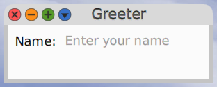
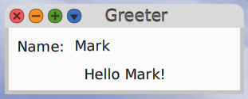

# Cuis-Smalltalk-Greeter

This is a package for Cuis Smalltalk that demonstrates some aspects of using Morphic.
It adds the menu item "Greeter" to the World menu in the Open submenu.
Selecting this menu item opens a window that prompts for your name.
When a name is entered, it displays "Hello {name}!" below in the text input.

One thing this demonstrates is sizing a window based on its contents.

